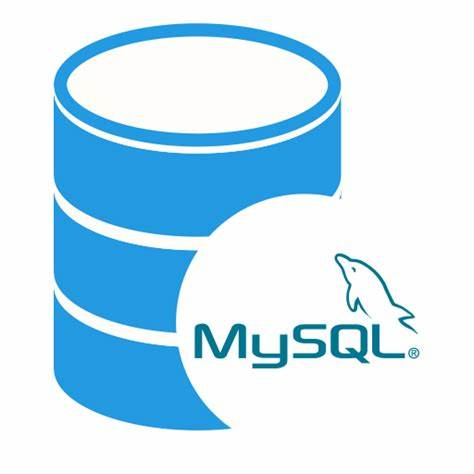

<h3 align="center"><strong>An open-source MySQL branch that integrates the mainstream MySQL engine</strong></h3>

 

# KylinDB

KylinDB is an open-source MySQL branch that integrates the mainstream MySQL engine.

# Contribution

KylinDB welcomes all kinds of contributions, such as contributing code to the code base, sharing your experience on how to use KylinDB, and providing insights in the community on the Forums, or contributing to projects that make KylinDB a better project. For more specifics, see:

- [Bug Report](Docs/contribute-templates/bug-report.yml)
- [Feature Request](Docs/contribute-templates/feature-request.md)
- [General Question](Docs/contribute-templates/general-question.md)
- [Pull Request](Docs/contribute-templates/pull_request_template.md)

# Getting Started

## Compile Command

- [Debug Version](./build-debug/my80-build.sh)
- [Release Version](./build-release/my80-build.sh)

See also [Installing MySQL from Source](https://dev.mysql.com/doc/refman/8.0/en/source-installation.html)

# Documentation

TODO

# Discussion

The [GitHub Discussions](https://github.com/kylindb/kylindb/discussions) is the home for most discussions and communications about the KylinDB project. We welcome your participation. Every single opinion or suggestion of yours is welcomed and valued. We anticipate KylinDB to be an open and influential project.
